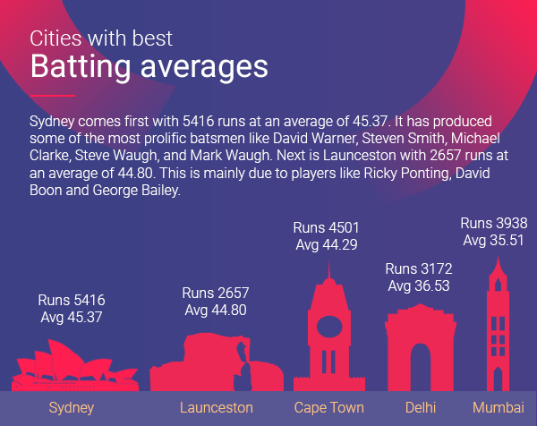
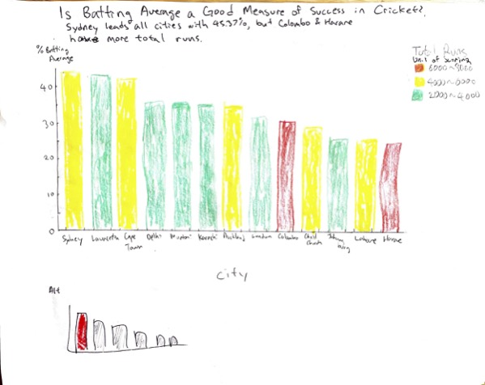
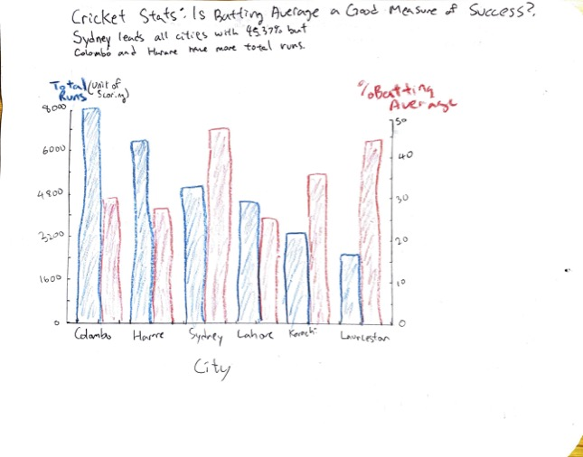

# Assignment 3 - Critique By Design

In this assignment, I searched for a visualization that could use improvment and critiqued it.
Then, I created some sketches to start the improvement process and tested the sketches to receive constructive feedback.

### Step 1: Find a Data Visualization
For this assignment, I found a visualization on batting averages for different cities in the 2019 Cricket World Cup.
The visualization captured my eye because of the unique representation of data through city monuments. The source of the visuaization can be found on this [website](https://runrepeat.com/your-city-cricket-world-cup-rankings)

### Step 2: Critique the Data Visualization

|Criteria|Score|Discussion|
|--------|-----|----------|
|Usefulness|6|After reading the text, and looking through the numbers, people will start to make sense of the visualization. I can see it being useful to those that are curious.|

### Step 3: Wireframe a Solution

### Step 4: Test the Solution

### Step 5: Build Your Solution

#### Flourish Version

#### Cricket Statisctics: Batting Average Might Not be the Best Measure for Success
Sydney leads all cities with a 45.37% batting average, but Colombo and Harare have more total runs.

#### Tableau Version

<object class='tableauViz'  style='display:none;'><param name='host_url' value='https%3A%2F%2Fpublic.tableau.com%2F' /> <param name='embed_code_version' value='3' /> <param name='site_root' value='' /><param name='name' value='CricketBattingAvg&#47;Sheet1' /><param name='tabs' value='no' /><param name='toolbar' value='yes' /><param name='animate_transition' value='yes' /><param name='display_static_image' value='yes' /><param name='display_spinner' value='yes' /><param name='display_overlay' value='yes' /><param name='display_count' value='yes' /><param name='language' value='en-US' /><param name='filter' value='publish=yes' /></object>

