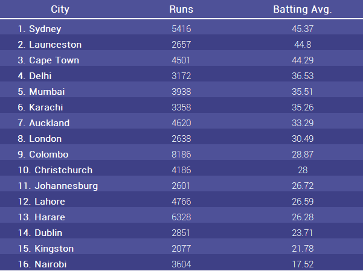

# Assignment 3 - Critique By Design

In this assignment, I searched for a visualization that could use improvment and critiqued it.
Then, I created some sketches to start the improvement process and tested the sketches to receive constructive feedback.

### Step 1: Find a Data Visualization
For this assignment, I found a visualization on batting averages for different cities in the 2019 Cricket World Cup.
The visualization captured my eye because of the unique representation of data through city monuments. The source of the visuaization can be found on this [website](https://runrepeat.com/your-city-cricket-world-cup-rankings)

I manually extracted the data using the following image:

### Step 2: Critique the Data Visualization

|Criteria|Score|Discussion|
|--------|-----|----------|
|Usefulness|6|After reading the text, and looking through the numbers, people will start to make sense of the visualization. I can see it being useful to those that are curious.|
|Completeness|3|Without the context of the article, it’s easy to mistake this for baseball looking at the title. People might not know what runs means|
|Perceptibility|1|The method of representing the data (city landscapes) have nothing to do with the data itself. It is actually misleading as the city with the highest average (Sydney) has a smaller landscape than others.|
|Truthfulness|4|The numbers themselves may be truthful, but the way the data is represented goes against the data.|
|Intuitiveness|3|Only once you see the numbers for runs and average is it easy to interpret. The text can give some context, but doesn’t make it easier to understand the visualization.|
|Aesthetics|5|The aesthetics themselves are acceptable, and the city landscapes are a creative way to represent the data. However, it distracts from the actual value of the data and if people are unfamiliar with the landscapes, they won’t make the connection to the city.|
|Engagement|5|After looking at the visualization, the audience might want to learn more about different cities and their batting averages. However, it wouldn’t inspire people to share the visualization.|

#### Overall Observations
When I first saw the visualization, I was hooked by the choice of visual representation of the data. However, within a few seconds I was disenchanted and frustrated by how the representation doesn’t align with the numbers. Sydney is supposed to be the city leading in batting average, but the landscape representing it is the smallest among the other cities shown.

I think the visualization uses decent color contrast between the text and background. The text family and font is consistent throughout. The colors are also very eye-catching and hooks the reader in.

Most of the visualization doesn’t work. The data being represented by city landscapes adds no value to better understanding the data at a glance, and is even misleading. The text is interesting for context, but I feel that it belongs in the article and distracts from the visualization itself.

I would change the visualization type to something that can actually represent the data and make it comparable. I would give different weights to the representations of the runs and averages, since the batting averages is the main data point to be discussed. I would also try to minimize the text in the visualization, as the discussion of specific players is interesting, but not integral to understanding the visualization.

#### Primary Audience
The primary audience for the visualization is for those following the Cricket World Cup. This audience might grasp the data more easily than the average person, but I believe it would still be confusing for the particular audience. No matter how knowledgable you are in Cricket, the fact that the visual elements misleads the viewer in the value of the batting averages means that it will be ineffective. 

#### Method Evaluation
I think that this method was a good way to evaluate the data visualization across many criteria. The critique method used by assignment 1 helped me grow my intuition in what to look for in a data visualization and different aspects that were immediately visible to me. However, Few’s method allows us to better analyze the visualization across specified criteria. Some missing elements include use of color, typography and other “physical” aspects of the visualization. However, it seems the evaluation of these elements are ingrained into certain criteria such as perceptibility, completeness, and intuitiveness.  

### Step 3: Wireframe a Solution

I wireframed two sketches to test with users. Although the original visualization only discussed the batting averages, I wanted to bring in total runs (total points) into the discussion as well. With these wireframes, I attempted two different methods to be able to compare and contrast the batting averages and total runs across the different cities.

In the first sketch, I kept the main focus on the batting averages and color coded the total runs into three different categories. With the title I tried to pose the quesiton of whether batting averages is really the best measure of success, given that the cities with high batting averages don't always have the most runs.

In the second sketch, I used a dual axis bar graph to represent both total runs and batting averages in the same graph. Compared to the first graph, it might be harder to immediately read the data, given that there are two different axes. However, I thought showing the bars for both batting averages and total runs allows viewers to better evaluate the relationship between the two variables.

### Step 4: Test the Solution

I tested the solution with two CMU students and received feedback from each wireframe.

Wireframe 1 Feedback:
- Need more context on what the visualization is about
- Color for Total Runs is confusing, it should be in a gradient
- Not clear what Total Runs means and it takes away from the overall message
- Easier to comprae the batting averages

Wireframe 2 Feedback:
- Not sure what "success" means in this context
- "Since the title talks about batting average, I would expect the chart to be ordered by batting average"
- This chart is better to see the difference in batting averages and total runs

Both participants were taken aback by the title being posed as a question. They suggested that the title be something simpler (Batting Averages for Cities), or something with a more direct message. There was also confusion on what total runs represented. After the first participant, I added the description that "Runs is a unit of scoring", which helped the second participant. In terms of the use of color, both participants liked the colors for the second wireframe (blue and red), but were confused by the colors used in the first (red, yellow, green). My intention was to represent the colors as high, medium, low, but they interpreted as bad, okay, and good (respectively). 

Both participants thought that the second wireframe was more effective at conveying the message. Even though the first wireframe was easier to read, the second wireframe more directly showed the disparity in batting average and total runs for the same city. This was an interesting instance of the pros and cons for simplicity and more information, where more information was more important for these particular participants. Based on the feedback, I started building solutions based on wireframe 2.

### Step 5: Build Your Solution

To build the solution, I tried using both Flourish and Tableau to improve on my second wireframe. I changed the title to be more declarative instead of posing a question, since the participants found that confusing. I also tried to label the variables clearly, especially Total Runs, so viewers have a better idea of what it means.
However, both platforms didn't allow me to execute my plan as I had hoped. The implementation of double axes seems to have put some constraints on the choices I have.

#### Flourish Version

#### Cricket Statistics: Batting Average Might Not be the Best Measure for Success
Sydney leads all cities with a 45.37% batting average, but Colombo and Harare have more total runs.

This was my best attempt to realize the visualization in Flourish. However, I believe this is an ineffective visualization because the line distracts from the overal message. The x-axis represents city and not time, so it doesn't make sense to use a line to represent this data. I like how the axes labels can be shown horizontally, but wish the labels were above their respective axis.

#### Tableau Version 1

<object class='tableauViz'  style='display:none;'><param name='host_url' value='https%3A%2F%2Fpublic.tableau.com%2F' /> <param name='embed_code_version' value='3' /> <param name='site_root' value='' /><param name='name' value='CricketBattingAvg&#47;Sheet1' /><param name='tabs' value='no' /><param name='toolbar' value='yes' /><param name='animate_transition' value='yes' /><param name='display_static_image' value='yes' /><param name='display_spinner' value='yes' /><param name='display_overlay' value='yes' /><param name='display_count' value='yes' /><param name='language' value='en-US' /><param name='filter' value='publish=yes' /></object>

#### Tableau Version 2

<object class='tableauViz'  style='display:none;'><param name='host_url' value='https%3A%2F%2Fpublic.tableau.com%2F' /> <param name='embed_code_version' value='3' /> <param name='site_root' value='' /><param name='name' value='CricketBattingAvgDots&#47;Sheet2' /><param name='tabs' value='no' /><param name='toolbar' value='yes' /><param name='animate_transition' value='yes' /><param name='display_static_image' value='yes' /><param name='display_spinner' value='yes' /><param name='display_overlay' value='yes' /><param name='display_count' value='yes' /><param name='language' value='en-US' /><param name='filter' value='publish=yes' /></object>
                

I attempted to implement the visualization in Tableau in two different ways - with circles representing the total runs as well as bars with lower opacity. I think the lines with lower opacity works better than the lines in Flourish. The version with circles might be less distracting, but it is harder to see the disparity between the batting average and total runs.
There are several aspects of the visualization that I wish I could cahnge. I couldn't find a way to place the axes labels horizontally instead of vertically, which is why I included the legend, even though it is redundant. I also found that Tableau doesn't have an option to place the x-axis label on the bottom, which is quite surprising.
Overall, I believe I did a better job than the original visualization in correctly represeting the data. However, I learned that it is a difficult task to compare two variables on different scales and struggled through different visualization tools and their own constraints to create the visualization I wanted to. Even for a dataset that seems relatively simple, I learned that it requires a lot of contemplation and attention to detail to create an effective visualization that conveys the story you want to convey. I think these are great lessons learned going into the final project.
